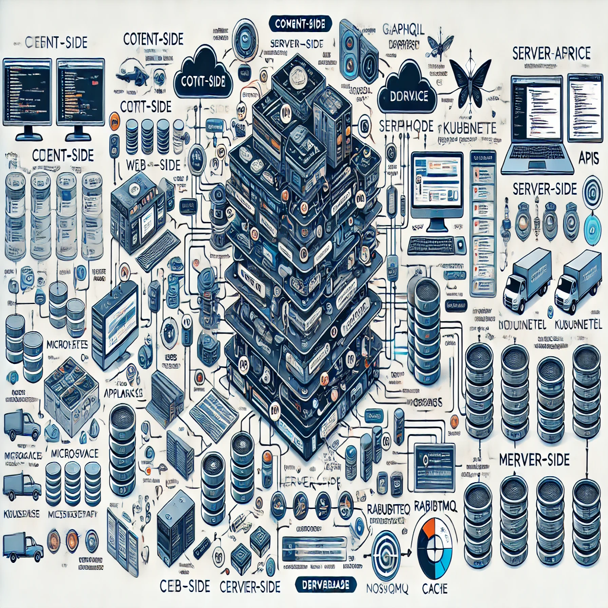

## 📱 07sd1fd's habitat

  
  
### Glad to see you here!  
I'm a seasoned full-stack developer whose freelancing experience has blossomed into a thriving full-time career. My expertise spans both client-facing applications and websites, alongside cutting-edge backend development.

I focus on crafting resilient backend systems that streamline operations for your applications and websites. I take pride in designing systems that are elegant yet robust, distributed yet cohesive, and not only aesthetically pleasing but also highly functional. Beyond development, I regularly share insights on system design, databases, security, servers, optimization, and emerging technologies such as Blockchain and PWAs through my blogging efforts.
 

## Status

<table><tr><td valign="top" width="50%">

- 🔭 I’m currently working on [Server](https://www.07sd1fd.com), diving deep into backend intricacies and optimizing performance. 🚀

- 🌱 I’m currently learning AWS, expanding my cloud skills to harness the full power of scalable and resilient architectures. ☁️

- ❓ Ask me about anything related to my stacks

- ⚡ Fun fact: I love Apple Devices && Vim

</td><td valign="top" width="50%">

</td></tr></table>

## Stacks

  
  
  
  
  
  
  
  
  
  
  
  
  
  
  
  
  
  
  
  
  
  
  
  
  
  
  
  
  
  
  
  
  
  
  

 

<!--
## Stats

<table><tr><td valign="top" width="50%">

</td><td valign="top" width="50%">

</td></tr></table>

 

 

-->

---

&copy 2024 <a href="https://www.07sd1fd.com/" target="_blank">07sd1fd</a>
